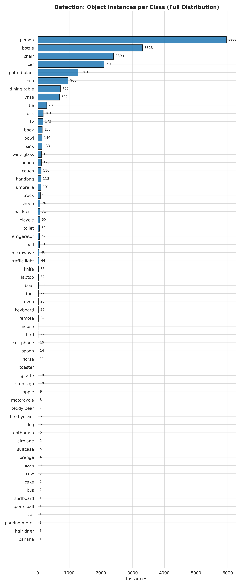
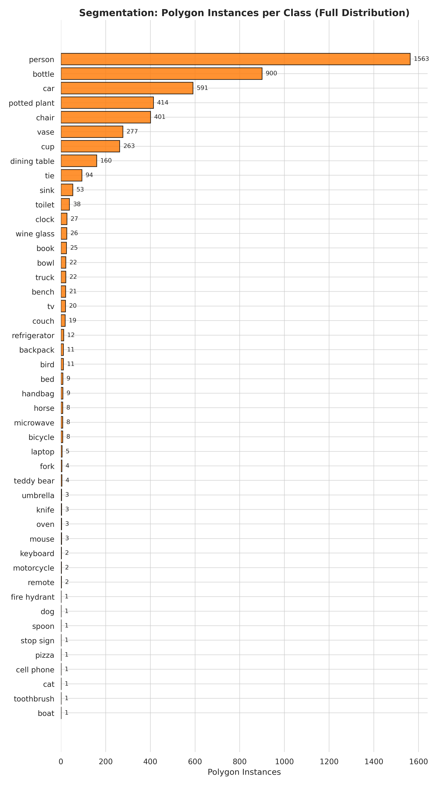

# HDRDCL: High Dynamic Range Detection in Challenging Lighting Conditions

HDRDCL is a benchmark dataset for **object detection and segmentation** under challenging illumination.  
It emphasizes scenarios where HDR preserves semantic content that would be lost in standard LDR imagery, such as deep shadows, bright highlights, and mixed/odd lighting, this git repo will update as label versions release, comments are highly encouraged (please note dataset labels are partly computer generated).

📂 Dataset URL: [Kaggle – HDRDCL](https://www.kaggle.com/datasets/multimedialabfau/hdrdcl-an-hdr-detection-and-segmentation-dataset)

---

## Dataset Structure

The dataset is organized into separate directories for detection and segmentation:

HDR_Detection_GT/
└── All_Detection_Combined/
├── <image>.exr or <image>.hdr # HDR input
├── <image>.json # bounding box annotations
└── <image>.png # Drago tone-mapped preview

HDR_Segmentation_GT/
└── All_Segmentation_Combined/
├── <image>.exr or <image>.hdr # HDR input
├── <image>.json # polygon segmentation annotations
└── <image>.png # Drago tone-mapped preview

- **Detection annotations:** bounding boxes  
- **Segmentation annotations:** polygons (masks)  
- **Preview PNGs:** tone-mapped using Drago for quick inspection  

Annotations are directly viewable and editable with [X-AnyLabeling](https://github.com/CVHub520/X-AnyLabeling).

---

## Tone Mapping Background

All HDR inputs were processed consistently before evaluation:

- **Clipping:** high luminance values clipped at `16.0` for stability  
- **Input domain:** images read as linear RGB (`float32`)  
- **Operators:**  
  - **LDR_simulation** – mid-luminance band mapping (ratio 255)  
  - **Linear** – percentile normalization (99.8% → white)  
  - **Logarithmic** – global log curve (base 10, ε=1e-6)  
  - **Drago (OpenCV)** – γ=2.2, bias=0.9, saturation=1.0, with percentile-window pre-exposure (1% → 0, 99.5% → 1)  
  - **Reinhard (OpenCV)** – γ=1.0, intensity=0.0, light_adapt=1.0, color_adapt=0.0, with percentile-window pre-exposure  
  - **Mantiuk (OpenCV)** – γ=2.2, scale=0.7, saturation=1.0, with percentile-window pre-exposure  

---

## Evaluation Results

We provide benchmark results across detection and segmentation models using COCO-style mAP@.5:.95.  

| Operator    | YOLO11X-Det | YOLO11S-Det | FRCNN-Det | YOLO11X-Seg | YOLO11S-Seg | MRCNN-Seg |
|-------------|-------------|-------------|-----------|-------------|-------------|-----------|
| LDR sim     | 0.388       | 0.260       | 0.287     | 0.338       | 0.238       | **0.350** |
| Linear      | 0.374       | 0.250       | 0.254     | 0.323       | 0.224       | 0.309     |
| Logarithmic | 0.347       | 0.221       | 0.212     | 0.290       | 0.204       | 0.269     |
| Mantiuk     | 0.372       | 0.244       | 0.270     | 0.339       | 0.227       | 0.313     |
| Reinhard    | **0.389**   | **0.282**   | **0.295** | **0.350**   | **0.245**   | 0.349     |
| Drago       | 0.389       | 0.250       | 0.280     | 0.335       | 0.233       | 0.328     |

- **Detection:** Reinhard consistently yields the strongest results.  
- **Segmentation:** Reinhard ties for best, while Mask R-CNN peaks on LDR simulation.  
- Operator choice influences results by a few points but does not overturn relative model rankings.  

---

## Instance Distributions

- **Detection (20,042 boxes):** head classes include *person*, *chair*, *car*, with a long tail of less frequent categories.  
- **Segmentation (5,052 polygons):** still dominated by *person*, but more balanced, with strong representation of *bottle*, *cup*, *potted plant*, and *vase*.  

  
  

---

## Citation

If you use HDRDCL in your research, please cite this git repository (paper citation coming soon)

